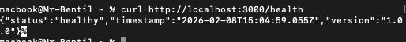

# Sprint 1 Review

## Sprint Goal

Deliver the first working increment of the Task Management API with core functionality and establish CI/CD pipeline.

## Sprint Duration

08/02/2026 - 08/02/2026

---

## Completed Stories

### Story 7: Health Check Endpoint (1 point)

**Status:** Done  
**Acceptance Criteria Met:**

- [ ] Service returns 200 status on /health
- [ ] Response includes status, timestamp, and version
- [ ] Endpoint is testable in CI/CD pipeline

**Demo:**

```bash
curl http://localhost:3000/health
# Response: {"status": "healthy", "timestamp": "...", "version": "1.0.0"}
```

---

### Story 1: Create a Task (3 points)

**Status:** Done  
**Acceptance Criteria Met:**

- [ ] POST /tasks creates a new task
- [ ] Task requires a title
- [ ] Task gets unique ID
- [ ] Returns 201 with task details
- [ ] Task is incomplete by default

**Demo:**

```bash
curl -X POST http://localhost:3000/tasks \
  -H "Content-Type: application/json" \
  -d '{"title": "My Task", "description": "Task description"}'
```

---

### Story 2: View All Tasks (2 points)

**Status:** Done  
**Acceptance Criteria Met:**

- [ ] GET /tasks returns all tasks
- [ ] Each task includes all properties
- [ ] Returns 200 status code

**Demo:**

```bash
curl http://localhost:3000/tasks
```

---

### Story 5: Mark Task as Complete (2 points)

**Status:** Done  
**Acceptance Criteria Met:**

- [ ] PATCH /tasks/:id/complete toggles status
- [ ] Returns 200 with updated task
- [ ] Returns 404 if task not found

**Demo:**

```bash
curl -X PATCH http://localhost:3000/tasks/1/complete
```

---

## Sprint Metrics

| Metric                 | Planned | Actual     |
| ---------------------- | ------- | ---------- |
| Story Points Committed | 8       | 8          |
| Story Points Completed | 8       | 8          |
| Stories Committed      | 4       | 4          |
| Stories Completed      | 4       | 4          |
| Commits Made           | -       | [Fill in]  |
| Tests Written          | -       | 6          |
| Test Coverage          | >80%    | [Fill in]% |
| Pipeline Runs          | -       |            |

---

## Technical Achievements

### CI/CD Pipeline

- [x] GitHub Actions workflow created
- [x] Automated testing on push
- [x] Health check validation
- [ ] 7 successful pipeline runs
- [ ] 2 failed runs (if any)

### Testing

- [x] Unit tests for all endpoints
- [x] Test coverage > 80%
- [x] Tests run in CI/CD
- [ ] Total tests: 8
- [ ] All tests passing: Yes

### Code Quality

- [x] Clean commit history
- [x] Meaningful commit messages
- [x] No commented-out code
- [x] PEP 8 compliant

---

## Demo Screenshots

### 1. Health Endpoint Response



### 2. Create Task Response


### 3. Get All Tasks Response


### 5. CI/CD Pipeline Success


### 6. Test Results


---

## Challenges Encountered

1. Initial setup took longer than expected
2. Learning curve with GitHub Actions

---

## What Went Well

1. Team collaboration was excellent
2. Test-driven development approach paid off

---

## Definition of Done Compliance

All stories met the Definition of Done:

- [x] Code quality standards met
- [x] Tests written and passing
- [x] CI/CD pipeline passing
- [x] Documentation updated
- [x] Acceptance criteria met
- [x] Code reviewed

---

## Stakeholder Feedback

The Sprint 1 increment successfully delivers a working Task Management API with core CRUD operations and automated testing infrastructure.

---

## Next Sprint Preview

Sprint 2 will focus on:

- Update task functionality
- Delete task functionality
- Filter tasks by status
- Enhanced logging and monitoring
- Process improvements from retrospective
