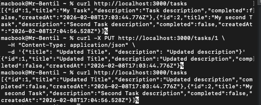
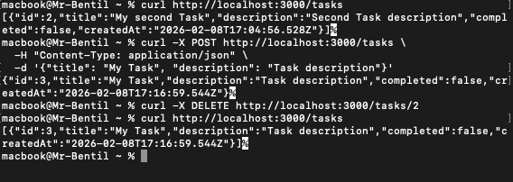
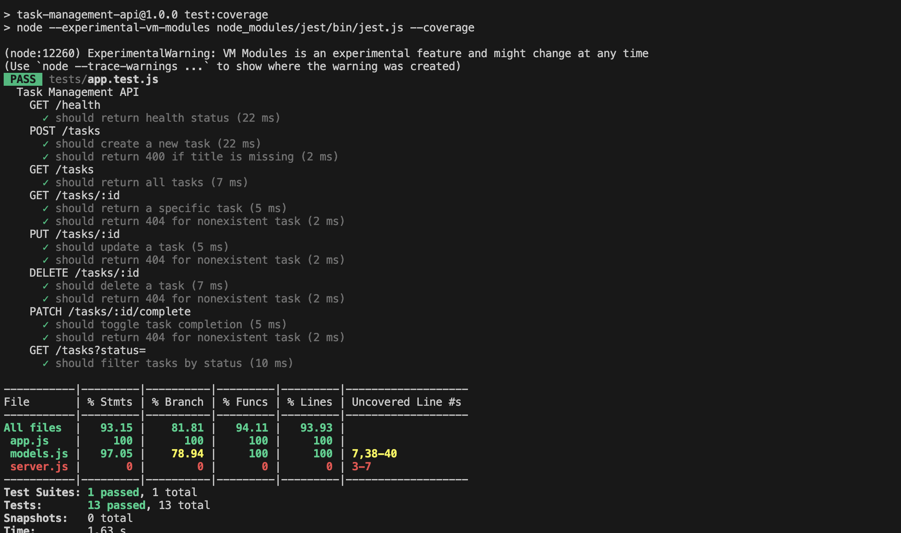

# Sprint 2 Review

## Sprint Goal

Deliver the second increment with update, delete, and filter functionality. Apply improvements from Sprint 1 retrospective and enhance monitoring.

## Sprint Duration

09/02/2026 - 11/02/2026

---

## Completed Stories

### Story 3: Update a Task (3 points)

**Status:** Done  
**Acceptance Criteria Met:**

- [ ] PUT /tasks/:id updates task
- [ ] Returns 200 with updated task
- [ ] Returns 404 if not found

**Demo:**

```bash
curl -X PUT http://localhost:3000/tasks/1 \
  -H "Content-Type: application/json" \
  -d '{"title": "Updated Title", "description": "Updated description"}'
```

---

### Story 4: Delete a Task (2 points)

**Status:** Done  
**Acceptance Criteria Met:**

- [ ] DELETE /tasks/:id removes task
- [ ] Returns 204 on success
- [ ] Returns 404 if not found

**Demo:**

```bash
curl -X DELETE http://localhost:3000/tasks/1
```

---

### Story 6: Filter Tasks by Status (2 points)

**Status:** Done  
**Acceptance Criteria Met:**

- [ ] GET /tasks?status=completed returns completed tasks
- [ ] GET /tasks?status=active returns active tasks
- [ ] Returns 200 status code

**Demo:**

```bash
curl http://localhost:3000/tasks?status=completed
curl http://localhost:3000/tasks?status=active
```

---

## Sprint Metrics

| Metric                 | Planned | Actual |
| ---------------------- | ------- | ------ |
| Story Points Committed | 7       | 7      |
| Story Points Completed | 7       | 7      |
| Stories Committed      | 3       | 3      |
| Stories Completed      | 3       | 3      |
| Tests Written          | -       | 7      |
| Test Coverage          | >80%    | >80%   |
| Pipeline Success Rate  | -       | 94%    |

---

## Improvements Applied from Sprint 1

1. **ESLint Integration:** Consistent code quality
2. **Stricter TDD:** All tests written before/during development

---

## Technical Achievements

### Monitoring & Logging

- [ ] Logging added to all endpoints
- [ ] Error tracking implemented
- [ ] Health endpoint enhanced

### Testing

- [ ] Total tests: 7
- [ ] Test coverage: >80%
- [ ] All tests passing: Yes

---

## Demo Screenshots

### 1. Update Task Response



### 2. Delete Task Response



### 5. Filtering tasks by status


### 6. Test Results



---

## Cumulative Project Metrics

| Metric            | Sprint 1 | Sprint 2 | Total |
| ----------------- | -------- | -------- | ----- |
| Story Points      | 8        | 7        | 15    |
| Stories Completed | 4        | 3        | 7     |
| Total Tests       | 6        | 7        | 13    |
| Test Coverage     | >80%     | >80%     |       |

---


## What Went Well

1. Zero bugs discovered in testing or review

---

## Definition of Done Compliance

All stories met the Definition of Done:

- [x] Code quality standards met
- [x] Tests written and passing
- [x] CI/CD pipeline passing
- [x] Documentation updated
- [x] Acceptance criteria met
- [x] Code reviewed
- [x] Monitoring/logging added

---

## Final Product Assessment

### Completeness

- [x] All planned features delivered
- [x] All acceptance criteria met
- [x] API fully functional

### Quality

- [x] Test coverage > 80%
- [x] CI/CD pipeline operational
- [x] Code follows standards
- [x] Documentation complete

### DevOps Practices

- [x] Version control with clean history
- [x] Automated testing
- [x] Continuous integration
- [x] Monitoring/logging

---

- The Sprint 2 increment successfully completes the Task Management API with full CRUD operations, filtering, and monitoring capabilities.

---

## Project Completion Summary

**Total Duration:** 1 week
**Total Story Points Delivered:** 15  
**Total Stories Completed:** 7  
**Final Test Coverage:** >80%  

**Project Status:** Complete
